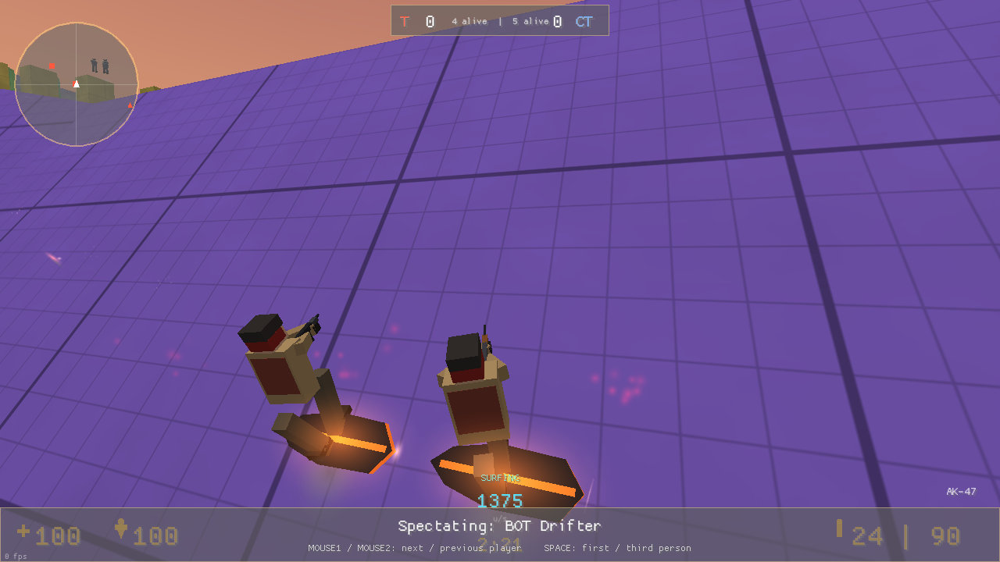
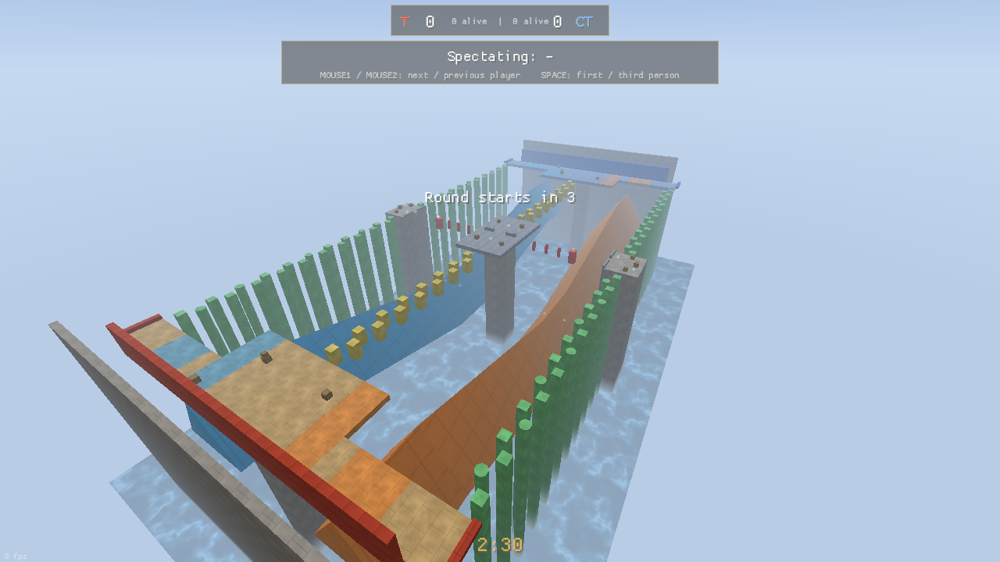
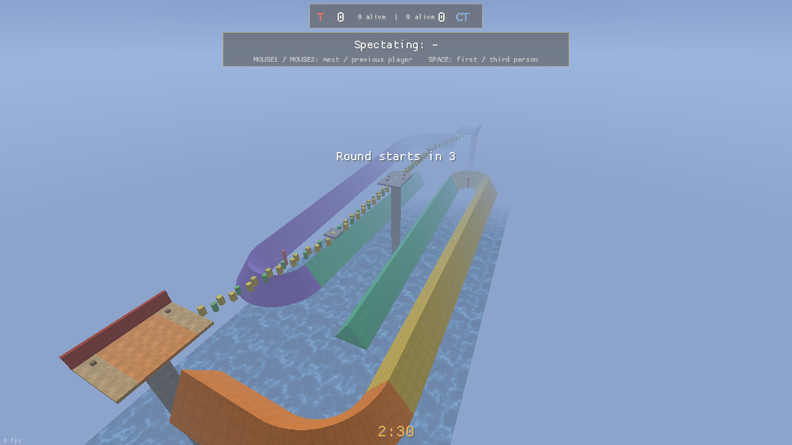
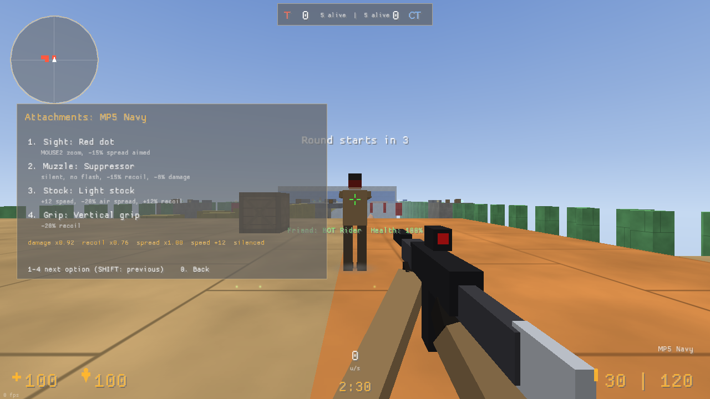

# SurfWars

A Counter-Strike 1.6 style surf combat game written in Rust (with
[macroquad](https://github.com/not-fl3/macroquad)). Two teams of players and
bots surf ramps, bunny hop across pillars and shoot each other with the
classic CS arsenal.


| | |
|---|---|
|  |  |
|  |  |
|  |  |

## Features

- **GoldSrc / CS 1.6 movement, ported line by line** from `pm_shared.c`:
  `PM_AirAccelerate` with the 30 u/s wish speed cap, `PM_FlyMove` clipping
  (this is what makes surfing work), ground friction and edge friction, the
  18 unit step-up, split gravity integration, duck timing and duck jumping,
  the CS jump stamina (`fuser2`) and landing slowdown, weapon based max
  speeds and the 100 Hz tick of a `fps_max 100` client.
- **Surf server settings**: by default everything is stock CS except what
  surf servers change: `sv_airaccelerate 100`, `sv_maxvelocity 3500` and no
  bunny hop speed cap. All of it can be changed in *Movement settings* (main
  menu or pause menu, applied live): presets *Surf server*, *Easy surf*
  (airaccelerate 150, gravity 650, auto bunny hop) and *CS stock*, or tune
  `sv_airaccelerate`, `sv_gravity`, `sv_maxvelocity`, `sv_accelerate`,
  `sv_friction`, auto bunny hop and the bunny hop cap yourself.
- **Hover boards**: every player gets a glowing board under their feet
  while they touch a surf ramp, with a team coloured trail at speed.
- **Weapons**: USP, MP5 Navy, M3 shotgun, AK-47, Scout and AWP (plus the
  knife) with CS 1.6 damage, fire rate, magazine sizes, reload times,
  movement speeds, spread formulas, recoil (`KickBack`), armor penetration,
  range falloff and hitbox multipliers. Scopes have two zoom levels. The buy
  menu only sells the USP, M3 and MP5; the AK-47, Scout and AWP are map
  pickups in hard to reach places.
- **Laser rifle and rocket launcher**: only available when you place them
  with the map editor. The laser is a dead accurate hitscan beam; rockets
  are projectiles with splash damage and knockback, so rocket jumps work.
- **Weapon attachments**: sights (red dot, holographic, 4x ACOG, which add
  an aim-down-sights zoom on Mouse 2), muzzles (suppressor, compensator, long
  barrel), stocks (light, heavy) and grips (vertical, angled, stubby). Each
  changes spread, recoil, damage, speed, reload or draw time; pick them in
  the buy zone (B, then 4). Bots get random attachments and adjust their
  firing range, burst length and scope use to them.
- **Map pickups**: weapon spawners and health packs (+50 HP) that respawn
  after 25 / 15 seconds. Walk into a weapon to pick it up, or press E to swap
  it for the gun you are holding.
- **Two teams, rounds or deathmatch**: CS style elimination rounds with
  freeze time, round timer, scores and a free buy menu in spawn; or
  deathmatch with instant respawns.
- **Bots that actually surf**: bots use the same movement code as you. They
  pick routes (surf lanes, bunny hop pillars or sniper towers), steer on
  ramps with perpendicular air strafes, bunny hop pillars with landing
  prediction, and fight with reaction times, tracking, recoil control and
  burst fire. Four difficulty levels.
- **Three maps** made of ramps with bunny hop sections. All bunny hop
  pillars are level, so you can hop back the way you came.
  - `surf_wars`: two long V shaped surf lanes between the spawns, a high
    middle island reached over pillars (with tiny-pillar perches holding an
    AK and a Scout), and two sniper towers with AWPs at the end of long
    bunny hop paths.
  - `surf_canyon`: three parallel lanes, pillar lines between them leading
    to mid platforms with AKs, a tiny-pillar perch with an AWP, and cross
    ramps below.
  - `surf_hairpin` (large): turning ramps. Each team drops onto a ramp that
    bends 90 degrees into a long straight, then a 180 degree hairpin sends it
    back down the middle past the other team. A long pillar line leads to a
    sky fort with an AWP, and the AKs sit on perches inside the hairpins that
    you only reach by jumping off the ramp at the right moment.
- **Map editor**: fly around, add boxes, slopes, surf ramps, 90 and 180
  degree turning ramps and pillars, move / resize / rotate / recolour them,
  place spawns and pickups (including the laser and rocket launcher), set
  the sky and fall height, save to `maps/<name>.map` and test play with bots.
  Saved maps appear in the main menu's map list.
- **Stuck bots die**: a bot that makes no progress for 7 seconds (outside
  camping spots) kills itself and respawns.
  Falling into the water teleports you back to your spawn, like on surf
  servers. The spawn floor is tinted with the colour of the ramp below it, so
  you can see where to drop in.
- CS 1.6 style HUD (health, armor, ammo, timer, scores, kill feed, dynamic
  crosshair, radar, scoreboard) plus a speedometer, and procedurally
  synthesized sounds.

## Building and running

Install Rust (<https://rustup.rs>), then:

```sh
cargo run --release
```

On Linux the sound backend needs the ALSA development package
(`sudo apt install libasound2-dev` on Debian/Ubuntu, `alsa-lib-devel` on
Fedora). To build without sound:

```sh
cargo run --release --no-default-features
```

Settings from the menu are stored in `surfwars.cfg` next to where you run
the game. On a machine without a sound device, start it with `--no-audio`.

## Controls

| Key | Action |
|---|---|
| W A S D | move |
| Space / mouse wheel | jump (the wheel is the classic bunny hop bind) |
| Ctrl / C | duck |
| Shift | walk |
| Mouse 1 | fire |
| Mouse 2 | scope (Scout, AWP) / aim down a zoom sight / stab (knife) |
| 1 2 3 | primary / pistol / knife |
| Q | last weapon |
| R | reload |
| G | drop weapon |
| B | buy menu (in your spawn); 4 in it opens attachments |
| E | swap your gun for the map weapon you stand at |
| Tab | scoreboard |
| V | third person camera, to see your own board |
| Esc | pause menu (sensitivity, team switch, restart) |

While dead: Mouse 1 / Mouse 2 cycle through players, Space toggles first and
third person.

### How to surf

Drop onto a ramp, look along it and hold the strafe key that pushes you *into*
the ramp (A if the ramp is on your left, D if it is on your right). Steer with
the mouse. Don't hold W on a ramp: the forward key only slows you down in the
air, exactly like in CS.

## Map editor

Main menu → *Map editor* opens the currently selected map (built-in maps are
saved as `<name>_edit`).

| Input | Action |
|---|---|
| hold right mouse | look around; WASD fly, Space / Ctrl up / down, Shift faster |
| left click | select a brush, spawn or pickup |
| panel buttons | add shapes, spawns and pickups (placed where you look), move / size / rotate / colour / texture / duplicate / delete the selection, grid size, sky, fall height, save, load, new, test play |
| arrows, Page Up / Down | move the selection (Shift: 4x) |
| R / F | rotate 15 degrees (spawns: turn their facing) |
| Delete | delete the selection |
| Ctrl + D / Ctrl + S | duplicate / save |

Maps are plain text (see `src/mapfile.rs`): every brush is the list of its
corner points, plus spawns, pickups, sky and fall height. Bots on editor maps
have no hand made routes, so they roam: they head for the enemy spawn or a
pickup, surf any ramp they land on and bunny hop across flat ground.

## Options

- **Ramp accuracy** (menu): in stock CS a player on a surf ramp is "in the
  air", which makes rifles almost useless while surfing. With the default
  *Surf* setting, riding a ramp uses the running accuracy instead, so fights
  between surfers are possible. *Classic CS* keeps the stock behaviour.
  Jumping and falling always use the in air spread.
- **Movement settings** (see above), **bot count per team**, **bot skill**,
  **mode**, **mouse sensitivity** (CS scale, `m_yaw 0.022`), **volume**.

## Code layout

| File | Purpose |
|---|---|
| `src/pmove.rs` | CS 1.6 player movement port and movement variables |
| `src/collision.rs` | convex brushes with bevel planes, box sweeps (GoldSrc hull semantics) |
| `src/map.rs` | built-in maps, turning ramps, spawns, pickups, buy zones, bot routes |
| `src/mapfile.rs` | text map files for the editor |
| `src/editor.rs` | in-game map editor |
| `src/weapons.rs` | weapon stats, attachments, CS accuracy and recoil formulas, armor |
| `src/game.rs` | game state, shooting, rockets, pickups, damage, rounds, triggers |
| `src/bot.rs` | bot navigation, surfing and bunny hop control, combat |
| `src/render.rs` | world, player models, boards, trails, effects, view model |
| `src/hud.rs` | HUD, radar, scoreboard, buy menu |
| `src/audio.rs` | sound synthesis and playback |
| `src/main.rs` | window, input, camera, menus |

### Tests

```sh
cargo test --release -- --nocapture
```

The tests check the movement (standing, jumping, surfing a ramp, ramp seams,
the stock bunny hop cap), weapon behaviour (auto fire and reloads, semi-auto
pistols, scope resume, shotgun shell reloads, headshots, rockets and rocket
jumps, attachments, the buy list), health pickups, map file round trips and
the editor tools, run a bot along every route of every map (failing if it
does not get through), and simulate full bot matches to make sure fights
happen and rounds end.

The binary can also render screenshots without user input, which is how the
images above were made:

```sh
cargo run --release -- --no-audio --shot out.png --cam spectate --after 11
```

`--cam` accepts `spectate`, `third`, `eye`, `overview`, `possess` and
`possess3`; `--ui buy|scores|pause|scope|attach|laser|rocket|movement|editor`,
`--map`, `--team t|ct`,
`--follow N` and `--look pitch,yaw` are also available.
